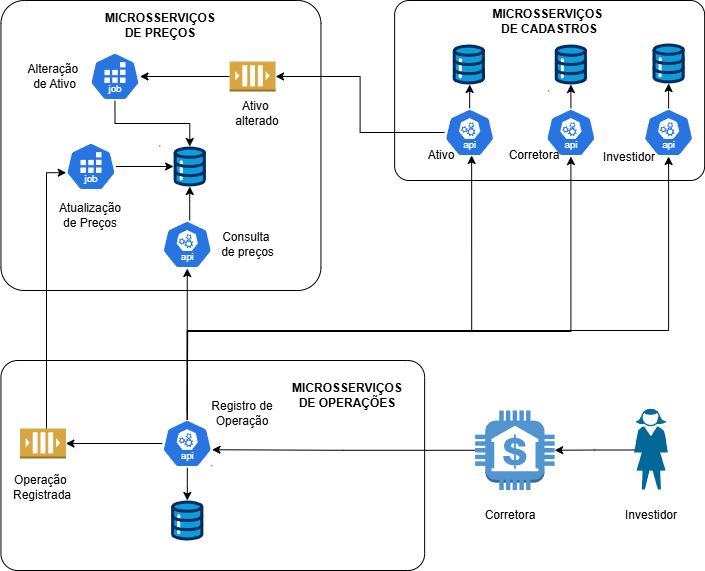

# Plataforma de Negociação de Ativos Financeiros

O projeto tem como objetivo simular, de forma parcial, o funcionamento de uma plataforma de negociação de ativos financeiros, reproduzindo o comportamento do mercado de ações. Trata-se de um sistema distribuído que permite a negociação de ativos por investidores por meio de operações de compra e venda. 

Antes de ser negociado, cada ativo deve ser previamente cadastrado na plataforma. Durante o período de negociação, o preço unitário varia dinamicamente em função da oferta e da demanda, sendo atualizado em tempo real. A plataforma monitora continuamente as atualizações de preços, gerencia negociações em tempo real e garante a integridade e consistência das transações, com mecanismos de validação que impedem operações inválidas, como tentativas de negociação com preços desatualizados ou quantidade insuficiente de ativos disponíveis.

O sistema foi desenvolvido no contexto da disciplina **ACH2147 - Desenvolvimento de Sistemas de Informação Distribuídos** (EACH-USP).

## Domínios do Sistema

A arquitetura foi decomposta em três domínios principais, seguindo os princípios do **Domain-Driven Design (DDD)** com o padrão *Decompose by Subdomain*:
 
- Domínio de Cadastro: responsável pelo gerenciamento das entidades fundamentais da plataforma — **ativos**, **investidores** e **corretoras** —, cada uma com seu próprio banco de dados dedicado seguindo o padrão *Database per Service*. O domínio expõe APIs REST com operações CRUD completas para cada entidade e publica eventos na fila `Ativo Alterado` sempre que um ativo é criado ou atualizado, notificando os demais serviços sobre mudanças cadastrais.

- Domínio de Precificação: responsável pela manutenção dos preços correntes dos ativos e pelo armazenamento do histórico completo de suas atualizações. O domínio é composto por dois jobs assíncronos: o **Job de Alteração de Ativo**, que consome a fila `Ativo Alterado` para criar o primeiro registro de precificação de novos ativos ou encerrar a vigência de ativos inativos; e o **Job de Atualização de Preços**, que consome eventos `Operação Registrada` para recalcular dinamicamente o preço com base na oferta e demanda. Também disponibiliza uma API REST de consulta de preços para outros serviços.
 
- Domínio de Operações: responsável pelo processamento das operações de compra e venda de ativos. O fluxo inicia com o recebimento da solicitação via API REST, seguido pelas validações de existência do investidor, corretora e ativo (consultando o domínio de cadastro) e obtenção do preço vigente (consultando o domínio de precificação). Após validação de saldo e quantidade disponível, a operação é registrada em banco de dados próprio, a quantidade do ativo é atualizada e um evento `Operação Registrada` é publicado na fila SQS. O domínio mantém duas tabelas de persistência: `Operacoes` (transações bem-sucedidas) e `FalhasOperacao` (operações rejeitadas com seus respectivos motivos).